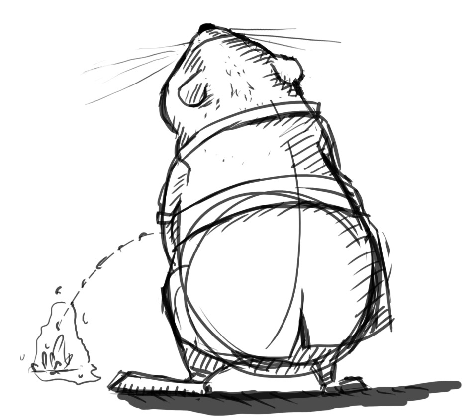

.. _index:

.. 
	helga_pipeline_documentation documentation master file, created by
	sphinx-quickstart on Sun May 18 20:10:32 2014.
	You can adapt this file completely to your liking, but it should at least
	contain the root `toctree` directive.

Helga pipeline documentation
============================

Welcome to the Helga pipeline documentation. Here you can find almost all answers to questions about how we do things within the Helga pipeline. It is the first place to look for answers if you have a questions. The second option is to ask me (Timm Wagener), you are very welcome to do that as often as possible, or write me an `email <mailto:wagenertimm@gmail.com?Subject=[Helga]%20Pipeline%20issue>`_.

.. note::
	**Please keep one thing in mind:**
	A pipeline, or at least our pipeline, is not at first place a bunch of scripts that a TD hacks together that will automate this and that.
	A pipeline really is an **agreement** between all project workers, to meet certain standards that make life easier for everybody.
	All scripting and automatization comes **after** that and just builds on top of that!

Manual
------

.. toctree::
	:maxdepth: 1
	
	manual/quick_guide
	manual/naming_convention
	manual/work_and_publish
	manual/pipeline
	manual/mesh_checklist
	manual/animation_checklist
	manual/photogrammetry_checklist
	manual/fur_hda_setup
	manual/i_am_a/i_am_a

API Documentation
-----------------

.. toctree::
   :maxdepth: 2

   manual/apidoc/apidoc_overview
   manual/apidoc/apidoc_coding_convention

-----------------------

.. autosummary::
	:toctree: apidoc/

	helga.houdini
	helga.maya
	helga.nuke
	helga.general

-----------------------

.. Debug Mode

.. ifconfig:: debug == True
	
	Debug mode: On

Indices and tables
==================

* :ref:`genindex`
* :ref:`modindex`

.. * :ref:`search`

